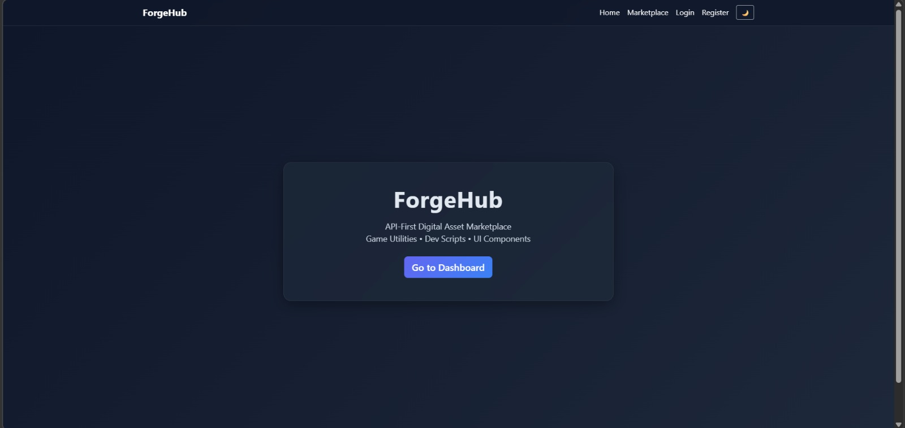
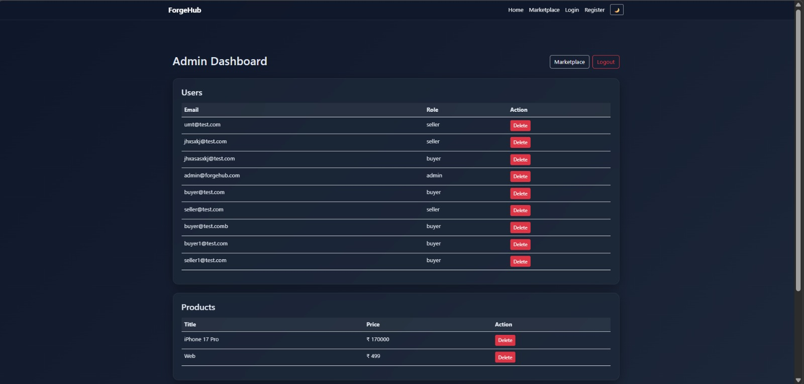
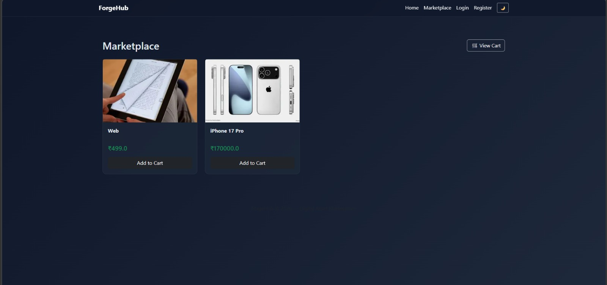
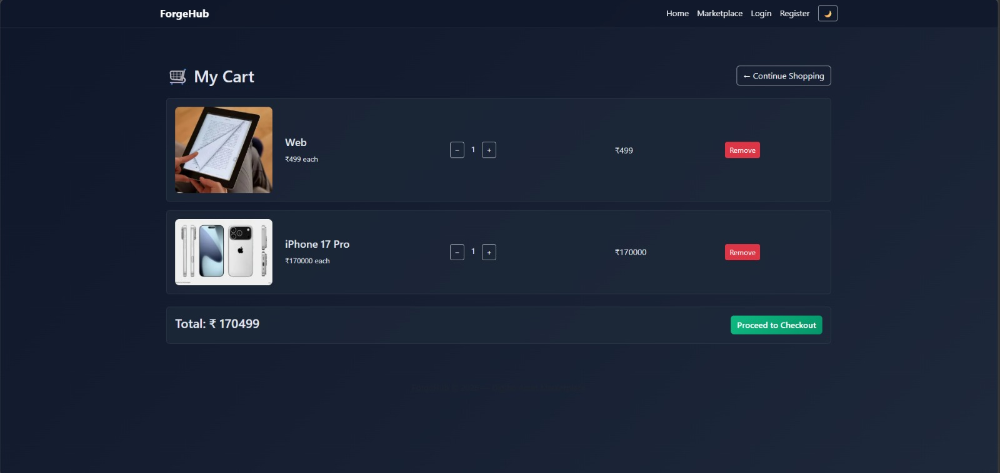

# ForgeHub – Role-Based Digital Marketplace

ForgeHub is a secure API-first digital marketplace built using Flask and SQLAlchemy.  
It implements JWT-based authentication and role-based access control for Admin, Seller, and Buyer users.

The system follows a modular Blueprint architecture and structured backend design.

---

## Project Overview

ForgeHub simulates a real-world digital asset marketplace where:

- Admin manages users and products  
- Sellers add and manage products  
- Buyers browse products, add to cart, and complete purchases  

The application demonstrates backend architecture design, secure authentication flow, and database relationship management.

---

## Architecture

ForgeHub follows a 3-Tier Architecture:

### Presentation Layer
- HTML
- CSS
- JavaScript
- Fetch API

### Application Layer
- Flask
- Blueprint modular routing
- JWT Authentication
- Role-based authorization middleware
- Exception handling

### Data Layer
- SQLAlchemy ORM
- Relational models
- Foreign key constraints
- Cascade delete rules
- Unique product constraint per seller

---

## Core Features

- JWT-based stateless authentication
- Role-based access control
- Product CRUD operations
- Admin dashboard for managing users and products
- Cart system with quantity handling
- Transaction recording
- Database integrity validation
- Structured error handling

---

## Tech Stack

- Python
- Flask
- Flask-JWT-Extended
- Flask-SQLAlchemy
- SQLAlchemy
- SQLite
- HTML / CSS / JavaScript

---

## Project Structure

ForgeHub/
│
├── app.py
├── config.py
├── models.py
├── requirements.txt
│
├── routes/
│ ├── auth.py
│ ├── products.py
│ ├── transactions.py
│ ├── admin.py
│ ├── cart.py
│
├── templates/
├── static/
├── screenshots/

---

## Request Flow

1. User performs an action on the frontend.
2. Fetch API sends request to backend route.
3. JWT validates identity.
4. Role middleware verifies authorization.
5. Business logic executes.
6. Database operation performed via ORM.
7. JSON response returned.
8. UI updates dynamically.

---

## Screenshots

### Home Page

### Admin Dashboard

### Marketplace

### Cart Page

---

## How to Run

1. Clone the repository:

git clone https://github.com/PallaviVasanth/ForgeHub-Flask-Ecommerce.git

2. Navigate into the project folder:

cd ForgeHub-Flask-Ecommerce

3. Create virtual environment:

python -m venv venv

4. Activate virtual environment (Windows):

venv\Scripts\activate

5. Install dependencies:

pip install -r requirements.txt

6. Run the application:

python app.py

7. Open in browser:

http://127.0.0.1:5000

---

## Future Improvements

- Payment gateway integration
- Image upload via file storage
- Pagination for large product listings
- Production deployment setup

---

## Developed By

Pallavi V
MCA – Full Stack Development.
